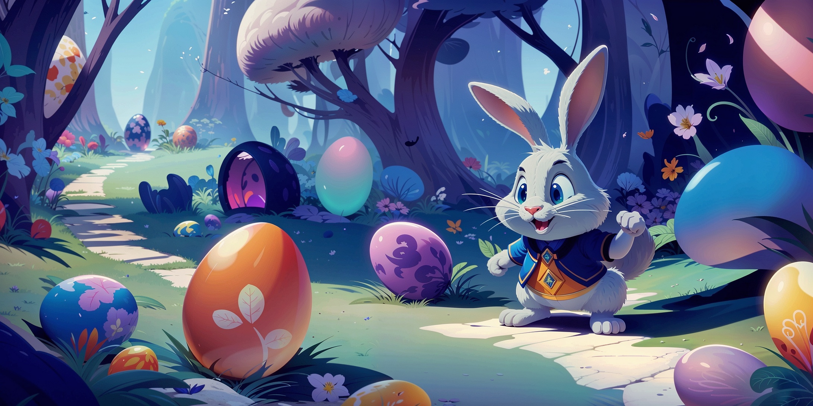

## Hey, this is Sparky 👋

> 🐰 This project is created and maintained in loving memory of **Sparky**, aka **Chispitas**, aka **Chispis**, in the hope he will become immortal and, eventually, one with the Force. 🐰  
> *To the moon and back, forever ❤*

We are a non-profit organization dedicated to creating and developing free (as in freedom) software specifically for the gaming industry.

Our mission is to empower developers and enthusiasts by providing open-source tools that enhance creativity and innovation. By prioritizing accessibility and collaboration, we aim to reshape the gaming landscape with ethical, community-driven solutions.

We have many projects, but we want to highlight a few, in a quite specific order:

- [Carbon](https://github.com/sparky-game/carbon), the ultimate high-level library for C/C++.
- [Volt](https://github.com/sparky-game/volt), a simple yet powerful game engine to enjoy videogames programming.

Join us in supporting a future where gaming technology is open, transparent, and free for everyone.

---

🤫 Psst! Take a look to our [official website](https://sparky-game.org) and its [source code](https://github.com/sparky-game/website).
